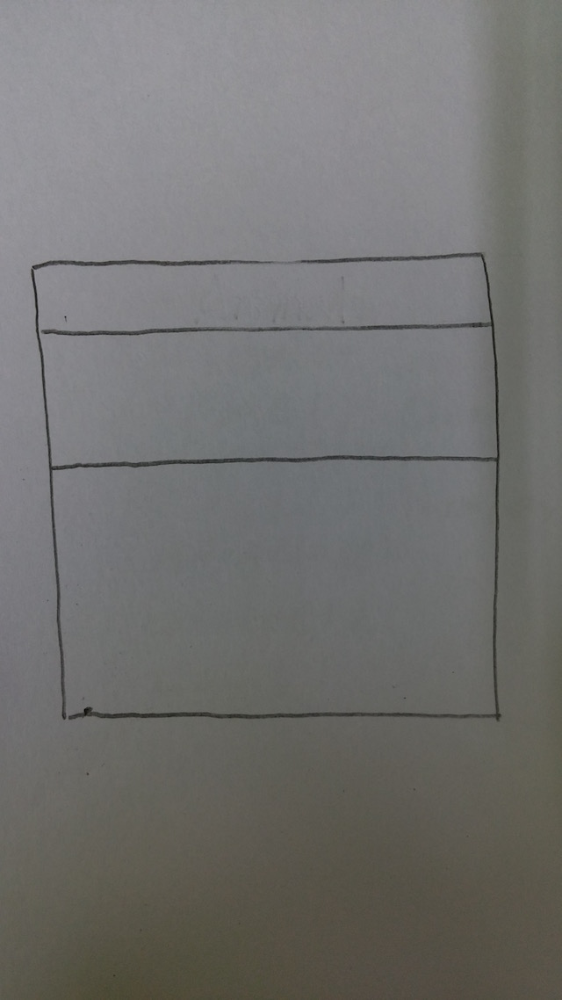
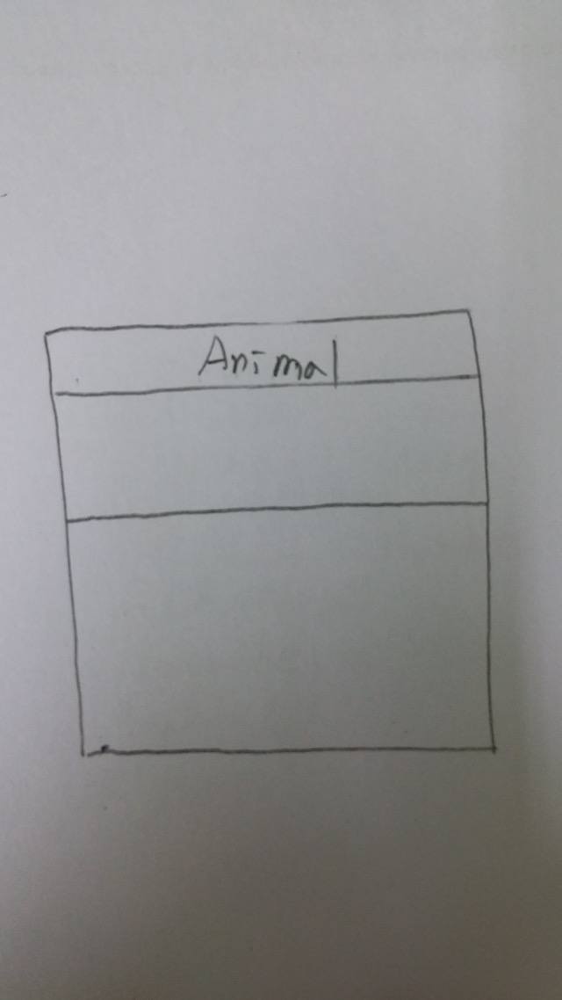
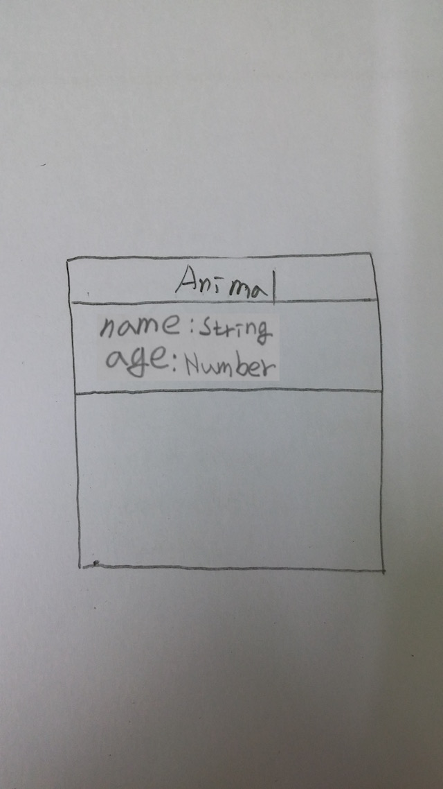
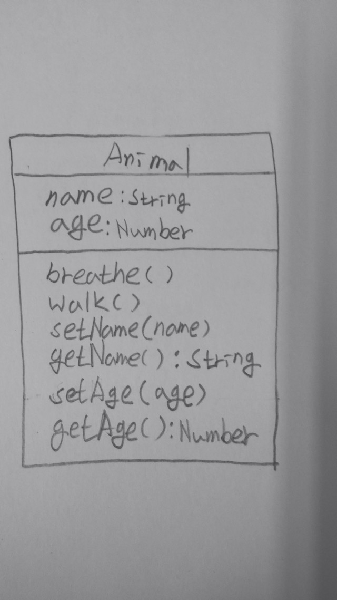
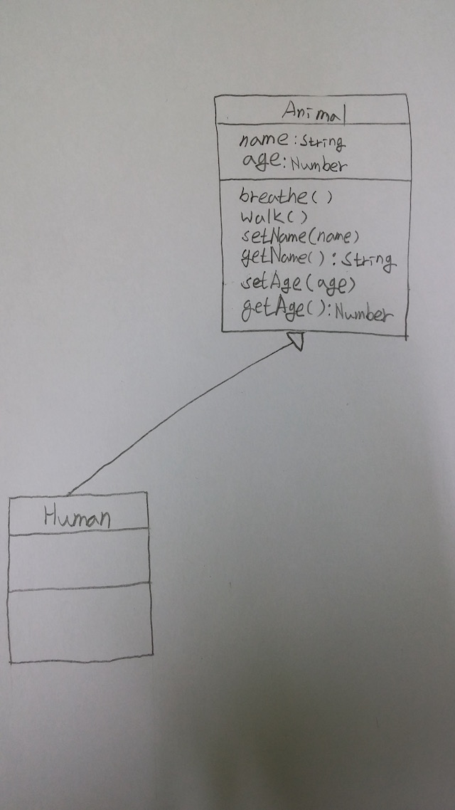

# ES2015, class의 시작
안녕하세요. 강승철입니다. 이번에 소개해드릴 내용은 ES2015 spec에 드디어 추가된 `class`입니다. 이걸 처음부터 설명을 안드린 이유는 이전 `function`을 이용한 `class` 설계와 크게 다르지 않다고 생각했었기 때문인데... 그렇지 않으신 모양입니다. (리엑트 스터디에 참석한 친구 이야기에 의하면...)

그래서, ES2015에서의 `class`에 대한 설명을 하면서 본격적인 객체지향 분석/설계시 필요한 약간의 기초지식도 함께 소개해드리도록 하겠습니다.
<br>
## class... 그림으로 그리기
제가 OOP를 좋아하는 이유는 코드나 말이 아닌, 그림으로 제가 구현하고자 하는 것을 표현할 수 있기 때문입니다. 그림은 꼭 개발자가 아니어도 누구나 알 수 있어서 지식전달에 매우 탁월합니다. 

일단 `class`를 그림으로 표현해보겠습니다.



위 그림은 [UML](https://ko.wikipedia.org/wiki/통합_모델링_언어)중 [Class diagram](https://en.wikipedia.org/wiki/Class_diagram)이라 합니다. class diagram은 클래스(class), 속성(attributes), 클래스간 함수(methods)를 이용하여 시스템의 구조를 기재하는 정적인 구조도입니다. 

하지만, 위 그림으로는 그 어떠한 정보도 얻을 수 없는 상태입니다. 이제 이 그림을 이용하여 Animal class를 표현해보겠습니다.



선으로 구분된 3영역 중 가장 윗부분은 class의 이름을 기술하는 영역입니다. 

이제 **Animal이 가져야 하는 것**이 무엇이 있는지를 정의해봅시다. 음.. 저는 이름(name)과 age(나이)를 가져야 한다고 생각합니다. 



선으로 구분된 3영역 중 중간 영역은*정의하고 있는 class가 가져야 하는 `속성(attributes)`을 정의하는 영역입니다. 속성 이름을 쓰고 콜론(:)을 이용하여 타입을 정의해줍니다.

그 다음으로 **Animal이 할 수 있는 행위**는 무엇이 있는지를 정의해봅시다. 여러분들은 어떻게 생각하실지 모르겠지만, 저는 숨을 쉴 수 있고(breathe), 걸을 수 있다고(walk) 생각합니다. 더불어서 이름도 설정(setName)/획득(getName)할 수 있고, 나이도 설정(setAge)/획득(getAge)할 수 있다고 생각합니다.



마지막으로 3영역 중 가장 아랫부분은 class가 할 수 있는 `행위(methods)`를 정의하는 영역입니다. 메소드 명을 적은 후 괄호(())를 붙여줍니다. setName이나 setAge와 같이 괄호 안에 무언가가 적혀 있는데, 이를 인자(arguments 또는 parameter)라 부르며 실해 메소드가 동작할 때 입력 받아야 하는 내용입니다. 또 getName이나 getAge와 같이 괄호 뒤에 콜론(:)이 붙어 있는 경우도 있는데, 이는 메소드가 실행되면 반환해야 하는 값의 타입을 기술한 것입니다. 
<br/>

## 그린 그림을 코드로 옮기기(1)

이를 기초로 ES3(or 5) spec으로 코드를 작성하면 다음과 같이 됩니다.

```
/* ES3(or 5) Spec */

function Animal () {
	this.name = null;
	this.age = null;
	console.log("Animal이 생성됩니다.");
}
Animal.prototype.breathe = function () {
	console.log("숨을 쉽니다.");
}
Animal.prototype.walk = function () {
	console.log("걷습니다.");
}
Animal.prototype.setName = function (name) {
	this.name = name;
}
Animal.prototype.getName = function () {
	return this.name;
}
Animal.prototype.setAge = function (age) {
	this.age = age;
}
Animal.prototype.getAge = function () {
	return this.age;
}

```

똑같이 위 class diagram을 기준으로 ES2015 spec으로 코드를 작성하면 다음과 같이 됩니다.

```
/* ES2015 Spec */

class Animal {

	constructor () {
		this.name = null;
		this.age = null;
		console.log("Animal이 생성됩니다.");
	}
	
	breathe () {
		console.log("숨을 쉽니다.");
	}
	
	walk () {
		console.log("걷습니다.");
	}
	
	setName (name) {
		this.name = name;
	}
	
	getName () {
		return this.name;
	}
	
	setAge (age) {
		this.age = age;
	}
	
	getAge () {
		return this.age;
	}
	
}

```

ES2015에서는 언어차원에서 `class`를 지원하도록 변경 되어 타언어진영이 (예를 들면 Java진영) JS를 바라볼 때 느끼던 이질감은 다소 해소될 것으로 보입니다.

## is-a
여기에서 `인간`을 생각해봅시다. `인간`과 `동물`을 어떻게 연관지어 문장으로 표현하면 어떻게 될까요? 제 생각으로는 이렇게 될 것 같습니다.

"인간은 동물이다."

이런 관계를 `is-a` 관계라 부릅니다. 이 관계를 class diagram으로 도식화 하면 다음과 같이 됩니다.



삼각형 화살표가 존재 하는 쪽 class를 `super class`와 존재하지 않는 쪽 class를 `subclass`라 칭하며, 이를 `상속(inheritance, generalization)`이라 부릅니다. 위 도식의 의미는 "Human class는 Animal class를 상속했다."라고 할 수 있습니다.

그리고, Animal class를 상속한 Human class는 Animal class가 가지고 있는 모든 속성과 메소드를 물려받습니다. ("물려받는다"는 표현이 어색할 수도 있는데, Human class에 따로 코드를 넣지 않아도 Animal class 처럼 동작한다는 의미임.)

<br/>

## 그린 그림을 코드로 옮기기(2)
다시 위 class diagram에 기초한 코드를 ES3(or 5) spec으로 표현하면 다음과 같습니다.

```
/* ES3(or 5) Spec */

function Animal () {
	this.name = null;
	this.age = null;
	console.log("Animal이 생성됩니다.");
}
Animal.prototype.breathe = function () {
	console.log("숨을 쉽니다.");
}
Animal.prototype.walk = function () {
	console.log("걷습니다.");
}
Animal.prototype.setName = function (name) {
	this.name = name;
}
Animal.prototype.getName = function () {
	return this.name;
}
Animal.prototype.setAge = function (age) {
	this.age = age;
}
Animal.prototype.getAge = function () {
	return this.age;
}

function Human () {
}
Human.prototype = new Animal();	

```

마찬가지로 위 class diagram을 기준으로 ES2015 spec으로 코드를 작성하면 다음과 같이 됩니다.

```
/* ES2015 Spec */

class Animal {

	constructor () {
		this.name = null;
		this.age = null;
		console.log("Animal이 생성됩니다.");
	}
	
	breathe () {
		console.log("숨을 쉽니다.");
	}
	
	walk () {
		console.log("걷습니다.");
	}
	
	setName (name) {
		this.name = name;
	}
	
	getName () {
		return this.name;
	}
	
	setAge (age) {
		this.age = age;
	}
	
	getAge () {
		return this.age;
	}
	
}

class Human extends Animal {

}

```

ES2015 spec에서는 Java처럼 `extends`라는 키워드로 `상속`표현할 수 있게 되었습니다. 

## is-a (2)

여기에서 `인간`의 친구인 `개`를 생각해봅시다. 그리고, `개`와 `동물`을 어떻게 연관지어 문장으로 표현하면 어떻게 될까요? 제 생각으로는 이렇게 될 것 같습니다.

"개은 동물이다."

네... `인간`이랑 같습니다. 이를 class diagram으로 도식화 하면 다음과 같습니다.
 